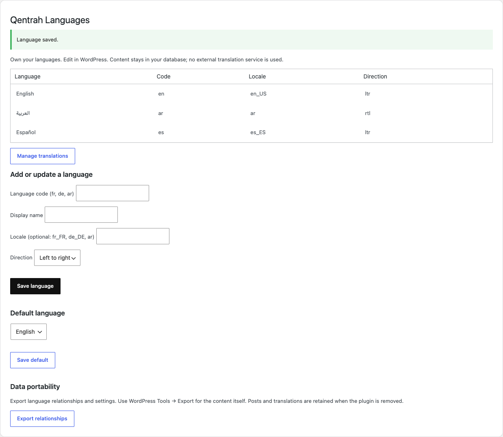
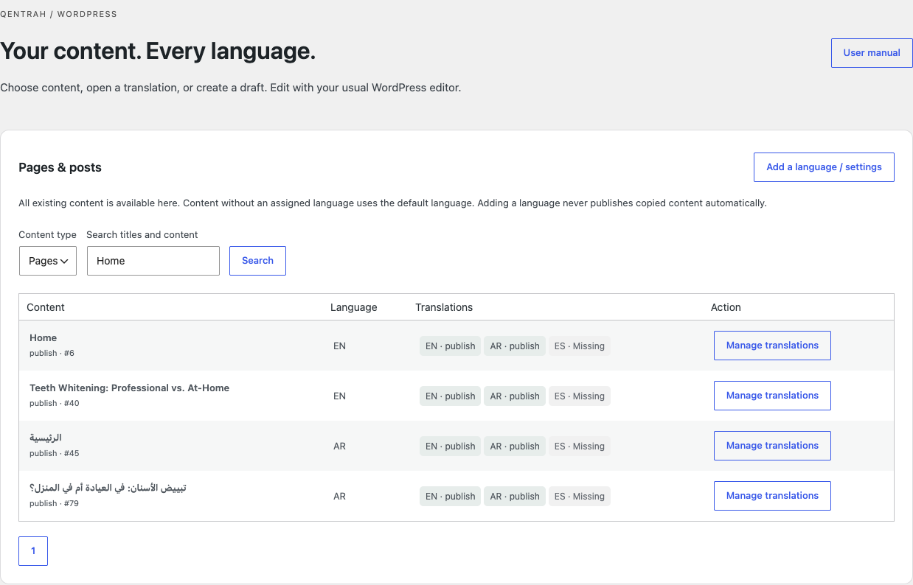
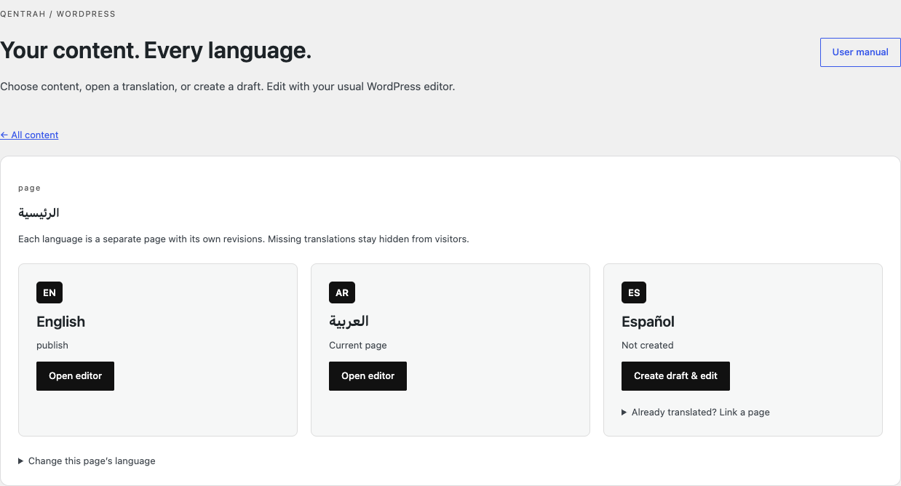

# Qentrah Languages user guide

[Online illustrated guide](https://www.qentrah.com/documentation/qentrah-languages) · [Offline EN/AR/ES/FR manual](https://github.com/Up-to-code/qentrah-languages/releases/download/v0.2.0/qentrah-languages-manual.zip)

## 1. Install & activate

Download qentrah-languages.zip from the product page or GitHub release. In WordPress, open Plugins → Add New → Upload Plugin. Select the ZIP, install, then activate. Requires WordPress 6.6+ and PHP 8.1+. Back up your site before updating. The manual ZIP is documentation, not an installable plugin.

## 2. Add your languages

Open the Languages icon in the WordPress menu, then Settings. Enter the display name and language code, such as English / EN, العربية / AR, or Español / ES. Codes are stored in lowercase. Locale is optional (for example en_US or es_ES); choose right-to-left for Arabic. Save language. Existing content uses the default language unless assigned explicitly. Adding a language makes it available; it does not automatically translate or publish copies.

## 3. Choose a page or post

Open Languages → Translations. Search content or change Content type to Pages, Posts, or a supported public content type. Select Manage translations. You can also use Translations in the Pages/Posts list or the Languages shortcut in the top toolbar. Save editor changes before leaving the editor. Only content you can edit is manageable.

## 4. Open or create a translation

Each language has a card. Open editor opens its existing version. Create draft & edit copies the source layout into a separate draft and opens the normal editor. Translate the text, review images and links, and publish when ready. It is a copy for manual translation, not machine translation. Already have another translated page? Expand “Already translated? Link a page” and enter its WordPress ID. It must use the same content type and cannot replace an existing translation.

## 5. Review changes safely

Translations are separate WordPress posts with their own revisions. When source content changes, its translation shows a review notice. Compare the source, update the translation, save, then mark it reviewed. There is no automatic overwrite or live synchronized editing. Use WordPress revisions to recover edits. Change a page’s assigned language only when its current assignment is wrong.

## 6. Show languages to visitors

Add the Language switcher block or [qentrah_languages] shortcode in a supported theme area. Dentora Production integrates it automatically. Only published matching translations appear; drafts and missing languages are hidden. WordPress keeps its normal URLs. The plugin adds language/direction and reciprocal hreflang for published versions. SEO rankings are not guaranteed; check your sitemap and SEO plugin on your own site.

## 7. Updates, ownership & support

Download versioned releases from GitHub; this preview does not automatically update through WordPress.org. Back up first, then upload the newer plugin ZIP and choose Replace current with uploaded. Your translations and settings remain in WordPress. Settings → Export relationships downloads a JSON map; use Tools → Export for content. Removing the plugin retains content but removes its switcher and language behavior. Free GPL-2.0-or-later. Report reproducible issues on GitHub without passwords or private content. WooCommerce, multisite and third-party builder integrations are not certified.
